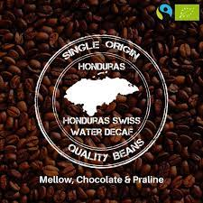

```{css, echo = FALSE}
.title, .subtitle {
  text-transform: uppercase;
  font-family: copperplate;
}
.author {
  font-family: "Times New Roman", Times, serif;
}
.date {
  font-family: papyrus;
}
body {
  background-color: white;
  color: black;
  font-size: 20px;
}
strong {
  color: grey;
}
.border {
  border: 5px solid yellow;
  padding: 5px;
  border-radius: 5px;
  background-color: white;
}

```

```{r setup, include=FALSE}
knitr::opts_chunk$set(echo = FALSE)

# Learn more about creating blogs with Distill at:
# https://rstudio.github.io/distill/blog.html

```

  I will show some infomation about covid-19 in Honduras, the data come from package `tidycovid19`. It contains the COVID data since Jan 2020. The source of data comes from mutiple website, such as the Johns Hopkins University CSSE Github Repo and the European Centre for Disease Prevention and Control. We can find more information from the [github](https://github.com/joachim-gassen/tidycovid19). In addition to, I put the websit of World Health Organization. There are more infromation about 

\


The coffee of Honduras is famous all over the world, and they are the one of the largest countries of coffee bee output. I am the big fan of Honduras coffee bee, so this is the reason why I choose Honduras. The __Covid-19__ has large impact on the their coffee industry.




__Reference__

tidycovid19, Joachim Gassen, URL: [https://github.com/joachim-gassen/tidycovid19](https://github.com/joachim-gassen/tidycovid19)

Photo: Virus of Covid-19

Photo: Coffee of Honduras
