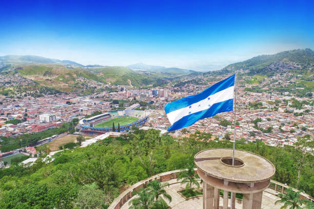

```{r setup, include=FALSE}
knitr::opts_chunk$set(echo = FALSE)
```

```{css, echo = FALSE}
.title, .subtitle {
  text-transform: uppercase;
  font-family: copperplate;
}
.author {
  font-family: "Times New Roman", Times, serif;
}
.date {
  font-family: papyrus;
}
body {
  background-color: white;
  color: black;
  font-size: 20px;
}
strong {
  color: grey;
}
.border {
  border: 5px solid yellow;
  padding: 5px;
  border-radius: 5px;
  background-color: white;
}

```

My name is Ruiqi Tang majored in the Business Analytics. I am studying the creating of Blog. This is my first blog. I want to share some information about the Covid-19 in Honduras




__Reference__

Photo: Flag of Honduras

Photo: the sea of Honduras
